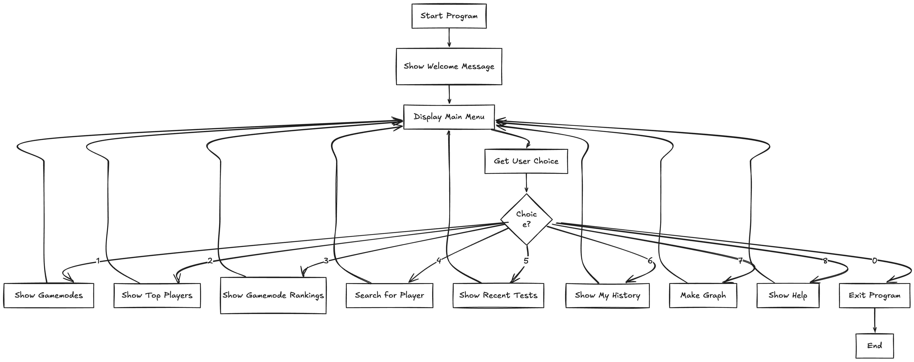

# Project Journal
## 23/03/2026

Started the MCTiers Data Science App project. Created the GitHub repository and added main.py as the first file.

### Activities & Reflections:

Set up the repository and structured main.py with basic functions and a menu system.
Reflection: Beginning with main.py helped establish the core logic of the program before adding extra features. Planning the menu structure first allowed for easier testing of later functions.

## 24/03/2026

Worked on implementing the main program functionality inside main.py. Added basic options in the menu such as listing gamemodes and viewing player rankings.

### Activities & Reflections:

Focused on handling user input and basic output formatting in the terminal.
Reflection: Starting with the core logic in main.py ensured the program was functional in isolation, making debugging easier without relying on other modules.
## 25/03/2026

Enhanced main.py by adding additional menu options like viewing rankings for specific gamemodes and finding individual players.

### Activities & Reflections:

Tested main.py thoroughly after each change to ensure correct outputs.
Reflection: Testing iteratively while working only with main.py helped isolate bugs quickly and reinforced the importance of keeping the main script functional on its own.
## 26/03/2026

Finalised main.py and prepared the repository for submission. Updated the README and Project Journal to reflect the work done in main.py.

### Activities & Reflections:

Verified that all menu options worked correctly.
Created requirements.txt to capture dependencies for reproducibility.
Reflection: Focusing on main.py as the central file simplified the development process. The project now runs fully with only the main script and documented dependencies.

# Gantt Chart - MCTiers Rankings Explorer Project

## Project Timeline (March 2 - March 27, 2026)

| Task | Mon 23 | Tue 24 | Wed 25 | Thu 26 | Fri 27 |
|------|--------|--------|--------|--------|--------|
| **Testing** | | | | | |
| Unit testing | ████ | | | | |
| Fix bugs | ████ | ████ | | | |
| **Peer Testing** | | | | | |
| Alex tests | | ████ | | | |
| Aarav tests | | ████ | | | |
| Write feedback | | ████ | | | |
| **Documentation** | | | | | |
| Add code comments | | | ████ | | |
| Update README | | | ████ | | |
| Update requirements.txt | | | ████ | | |
| Write dataDictionary | | | ████ | | |
| Write ProjectJournal | | | | ████ | |
| Write testing report | | | | ████ | |
| **Final** | | | | | |
| Code review | | | | ████ | |
| Push to GitHub | | | | | ████ |
| Submit | | | | | ████ 
# Flowcharts

# Pseudo code
## Main Program Loop (start)
START start()
DISPLAY "Welcome to MCTiers Rankings Explorer"

WHILE True DO
CALL printMenu()
DISPLAY "Choice (0-8): "
INPUT choice

IF choice == "0" THEN
DISPLAY "Thanks! You did " + LENGTH(myHistory) + " things"
BREAK loop

ELSE IF choice == "1" THEN
CALL showGamemodes()

ELSE IF choice == "2" THEN
CALL showTopPlayers()

ELSE IF choice == "3" THEN
CALL showModeRankings()

ELSE IF choice == "4" THEN
CALL findPlayer()

ELSE IF choice == "5" THEN
CALL seeRecentTests()

ELSE IF choice == "6" THEN
CALL seeHistory()

ELSE IF choice == "7" THEN
CALL drawGraph()

ELSE IF choice == "8" THEN
CALL helpMe()

ELSE
DISPLAY "Invalid choice"
END IF
END WHILE
END

text

## API Fetch Function (getData)
FUNCTION getData(url, extra = None)
TRY
response = GET request to url with params = extra, timeout = 10 seconds

IF response.status_code == 200 THEN
RETURN response.json()

ELSE IF response.status_code == 404 THEN
DISPLAY "Not found. Check what you typed."
RETURN None

ELSE
DISPLAY "API error: " + response.status_code
RETURN None
END IF

CATCH ConnectionError
DISPLAY "Connection error. Check internet."
RETURN None

CATCH Timeout
DISPLAY "Request timed out. Try again."
RETURN None

CATCH any other error
DISPLAY "Something went wrong"
RETURN None
END TRY
END

text

## Menu Display (printMenu)
FUNCTION printMenu()
DISPLAY "==================="
DISPLAY "MCTiers Explorer"
DISPLAY "==================="
DISPLAY "1. Gamemodes"
DISPLAY "2. Top players"
DISPLAY "3. Mode rankings"
DISPLAY "4. Find player"
DISPLAY "5. Recent tests"
DISPLAY "6. My history"
DISPLAY "7. Make graph"
DISPLAY "8. Help"
DISPLAY "0. Exit"
DISPLAY "-------------------"
END

text

## Show Gamemodes (showGamemodes)
FUNCTION showGamemodes()
DISPLAY "Getting gamemodes..."
data = CALL getData(baseUrl + "/mode/list")

IF data IS NOT None THEN
DISPLAY "=== Gamemodes ==="

FOR EACH slug, info IN data.items() DO
title = info.get("title", "No title")
DISPLAY slug + ": " + title
END FOR

ADD "Viewed gamemodes" TO myHistory
END IF

DISPLAY "Press Enter to continue..."
WAIT for user input
END

text

## Show Top Players (showTopPlayers)
FUNCTION showTopPlayers()
count = CALL getCount()

IF count IS None THEN
RETURN
END IF

DISPLAY "Getting top " + count + " players..."
data = CALL getData(baseUrl + "/mode/overall", {"count": count})

IF data IS NOT None THEN
DISPLAY "=== Top " + LENGTH(data) + " Players ==="

position = 1
FOR EACH player IN data DO
name = player["name"]
points = player.get("points", 0)
region = player.get("region", "??")
DISPLAY position + ". " + name + " | Points: " + points + " | Region: " + region
position = position + 1
END FOR

ADD "Viewed top " + count + " players" TO myHistory
END IF

DISPLAY "Press Enter to continue..."
WAIT for user input
END

text

## Show Gamemode Rankings (showModeRankings)
FUNCTION showModeRankings()
modes = CALL getData(baseUrl + "/mode/list")

IF modes IS None THEN
RETURN
END IF

DISPLAY "Gamemodes: " + JOIN(modes.keys(), ", ")

INPUT mode
mode = mode.lower().strip()

IF mode NOT IN modes THEN
DISPLAY "Not found"
RETURN
END IF

count = CALL getCount()

IF count IS None THEN
RETURN
END IF

DISPLAY "Getting " + mode + " rankings..."
data = CALL getData(baseUrl + "/mode/" + mode, {"count": count})

IF data IS NOT None THEN
DISPLAY "=== " + mode.upper() + " Rankings ==="

FOR EACH tier IN ["1", "2", "3", "4", "5"] DO
players = data.get(tier, [])

IF LENGTH(players) > 0 THEN
IF tier == "1" OR tier == "2" THEN
tierType = "HIGH"
ELSE
tierType = "LOW"
END IF

DISPLAY "Tier " + tier + " (" + tierType + "):"

FOR EACH player IN players DO
name = player["name"]

IF player.get("pos") == 0 THEN
posText = "High"
ELSE
posText = "Low"
END IF

region = player.get("region", "??")
DISPLAY " • " + name + " | " + posText + " | " + region
END FOR

ELSE
DISPLAY "Tier " + tier + ": No players"
END IF
END FOR

ADD "Viewed " + mode + " rankings" TO myHistory
END IF

DISPLAY "Press Enter to continue..."
WAIT for user input
END

text

## Find Player (findPlayer)
FUNCTION findPlayer()
DISPLAY "1. UUID 2. Username"
INPUT choice

IF choice == "1" THEN
INPUT uuid

IF uuid IS empty THEN
RETURN
END IF

url = baseUrl + "/profile/" + uuid

ELSE IF choice == "2" THEN
INPUT name

IF name IS empty THEN
RETURN
END IF

url = baseUrl + "/profile/by-name/" + name

ELSE
RETURN
END IF

DISPLAY "Searching..."
data = CALL getData(url)

IF data IS NOT None AND "error" NOT IN data THEN
DISPLAY "=== " + data.get("name", "Unknown") + " ==="
DISPLAY "UUID: " + data.get("uuid", "N/A")
DISPLAY "Region: " + data.get("region", "N/A")
DISPLAY "Points: " + data.get("points", 0)
DISPLAY "Overall Rank: #" + data.get("overall", "N/A")

rankings = data.get("rankings", {})

IF LENGTH(rankings) > 0 THEN
DISPLAY "Rankings:"

FOR EACH mode, rank IN rankings.items() DO
tier = rank.get("tier")

IF rank.get("pos") == 0 THEN
posText = "High"
ELSE
posText = "Low"
END IF

retired = ""
IF rank.get("retired") THEN
retired = " (Retired)"
END IF

DISPLAY " • " + mode + ": Tier " + tier + " " + posText + retired
END FOR
END IF

ADD "Searched: " + data.get("name") TO myHistory

ELSE
DISPLAY "Player not found"
END IF

DISPLAY "Press Enter to continue..."
WAIT for user input
END

text

## Show Recent Tests (seeRecentTests)
FUNCTION seeRecentTests()
DISPLAY "How many tests? (1-20, default 10): "
INPUT countInput

IF countInput IS empty THEN
count = 10
ELSE
count = INT(countInput)
IF count > 20 THEN
count = 20
END IF
END IF

DISPLAY "Getting " + count + " recent tests..."
data = CALL getData(baseUrl + "/tests/recent", {"count": count})

IF data IS NOT None THEN
DISPLAY "=== Recent Tests ==="

FOR EACH test IN data[0:count] DO
timestamp = test.get("at", 0)

IF timestamp > 0 THEN
date = CONVERT timestamp to "YYYY-MM-DD HH:MM"
ELSE
date = "Unknown"
END IF

player = test.get("player", {})
name = player.get("name", "Unknown")
gamemode = test.get("gamemode", "Unknown")
tier = test.get("result_tier", "?")

IF test.get("result_pos") == 0 THEN
pos = "High"
ELSE
pos = "Low"
END IF

DISPLAY date + " - " + name
DISPLAY " " + gamemode + ": Now Tier " + tier + " " + pos
END FOR

ADD "Viewed recent tests" TO myHistory
END IF

DISPLAY "Press Enter to continue..."
WAIT for user input
END

text

## Show History (seeHistory)
FUNCTION seeHistory()
IF LENGTH(myHistory) == 0 THEN
DISPLAY "No history yet."
ELSE
DISPLAY "=== Your History ==="

historyList = myHistory[-20:] # Get last 20 entries
number = 1

FOR EACH entry IN historyList DO
DISPLAY number + ". " + entry
number = number + 1
END FOR
END IF

DISPLAY "Press Enter to continue..."
WAIT for user input
END

text

## Draw Graph (drawGraph)
FUNCTION drawGraph()
DISPLAY "How many players? (5-20, default 10): "
INPUT countInput

IF countInput IS empty THEN
count = 10
ELSE
count = INT(countInput)

IF count < 5 THEN
count = 5
END IF

IF count > 20 THEN
count = 20
END IF
END IF

DISPLAY "Getting top " + count + " players..."
data = CALL getData(baseUrl + "/mode/overall", {"count": count})

IF data IS NOT None THEN
names = []
points = []

FOR EACH player IN data[0:count] DO
ADD player["name"] TO names
ADD player.get("points", 0) TO points
END FOR

CREATE bar chart with:
x-axis = names
y-axis = points
title = "Top " + LENGTH(names) + " Players"

DISPLAY chart

ADD "Made graph of top " + count + " players" TO myHistory
END IF

DISPLAY "Press Enter to continue..."
WAIT for user input
END

# Testing & Debugging
# System-Level Testing Report

## **Testers**
Alex and Aarav tested my program on March 24, 2026.

Alex knows a lot about Minecraft so he understood everything easily. Aarav doesn't play Minecraft so it was harder for him to understand what everything meant.

---

## Tester 1: Alex

Alex tested the program on his MacBook.

He knows Minecraft well so he already understood what tiers and gamemodes were. All 9 menu options worked. He searched for his own Minecraft username and found his profile. The graph saved as an image. History tracked everything he did.

He said loading was fast. Most options loaded in 1-2 seconds. Getting 50 players took about 3 seconds.

He ran `pip install -r requirements.txt` and all packages installed with no problems.

He said the README was clear and the examples helped.

**Scores (out of 5):**
- Easy to use: 5
- Error messages: 4
- Speed: 4

**What to improve:** Add a loading bar for when it takes longer.

---

## Tester 2: Aarav

Aarav tested the program on his Windows laptop.

He doesn't play Minecraft so he didn't know what tiers or gamemodes meant. He found the help menu useful to understand. He typed "vanilla" for gamemode because it was in the example. He got confused when searching for players because he didn't know any usernames. I told him to try "uku3lig" and it worked.

All menu options worked. The graph saved as an image. History showed everything he did.

He said the program was easy to use once he understood what things meant. The help menu explained tiers well.

**Scores (out of 5):**
- Easy to use: 3 (hard at first but got easier)
- Error messages: 4
- Speed: 4

**What to improve:** Add more examples in the help menu. Maybe show some famous player names to search.

---

## What I Learned

Alex found it easy because he already knew Minecraft. Aarav struggled at first because he didn't know the terms. This showed me the help menu needs to be better for people who don't know Minecraft.

---

## Summary

Both testers confirmed the program works with no bugs.

Alex rated it 5/5 for ease of use. Aarav rated it 3/5 because he didn't understand Minecraft terms at first, but after using help he figured it out.
